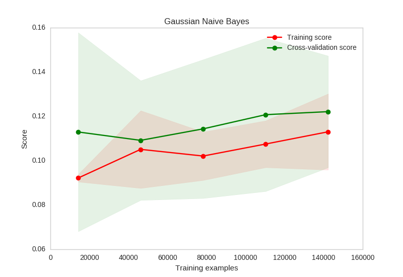

# Capstone Project - Machine Learning Engineer Nanodegree

## Definition

### Project Overview

New users on Airbnb can book a place to stay in 34,000+ cities across 190+ countries. By accurately predicting where a new user will book their first travel experience, Airbnb can share more personalized content with their community, decrease the average time to first booking, and better forecast demand.
Airbnb challenges us to predict in which country a new user will make his or her first booking.


It is a [Kaggle Competition](https://www.kaggle.com/c/airbnb-recruiting-new-user-bookingsorganized by Airbnb). The datasets are available [here](https://www.kaggle.com/c/airbnb-recruiting-new-user-bookings/data).
Kaggle is a wonderful platform for Data Scientists and Machine Learning Engineers. The goal is to work on this challenge to gain knowledge and practice Machine Learning Techniques.

### Problem Statement

In this challenge, I am given a list of users along with their demographics, web session records, and some summary statistics. I am asked to predict which country a new user's first booking destination will be.

* All the users in the dataset are from the USA,
* 12 possible outcomes of the destination country: US, FR, CA, GB, ES, IT, PT, NL, DE, AU, NDF (no destination found), and 'other'
* Datasets
  * countries.csv
  * sessions.csv
  * train_users_2.csv
  * age_gender_bkts.csv
* The training and test sets are split by dates
  * Test set: activity after 12/5/2015
  * Sessions dataset: the data only dates back to 1/1/2014 while the users dataset dates back to 2010

**Datasets Description**

The file description can be found on [Kaggle](https://www.kaggle.com/c/airbnb-recruiting-new-user-bookings/data).

**train_users.csv** - the training set of users.

**test_users.csv** - the test set of users.

* id: user id
* date_account_created: the date of account creation
* timestamp_first_active: timestamp of the first activity, note that it can be earlier than date_account_created or date_first_booking because a user can search before signing up
* date_first_booking: date of first booking
* gender
* age
* signup_method
* signup_flow: the page a user came to signup up from
* language: international language preference
* affiliate_channel: what kind of paid marketing
* affiliate_provider: where the marketing is e.g. google, craigslist, other
* first_affiliate_tracked: whats the first marketing the user interacted with before the signing up
* signup_app
* first_device_type
* first_browser
* country_destination: this is the target variable you are to predict

**sessions.csv** - web sessions log for users.

* user_id: to be joined with the column 'id' in users table
* action
* action_type
* action_detail
* device_type
* secs_elapsed

**countries.csv** - summary statistics of destination countries in this dataset and their locations.

**age_gender_bkts.csv** - summary statistics of users' age group, gender, country of destination.

**sample_submission.csv** - correct format for submitting your predictions.

### Metrics

For each new user, I am to make a maximum of **5 predictions** on the country of the first booking. The ground truth country is marked with relevance = 1, while the rest have relevance = 0.

**Definition**

The Metrics used in this competition is the **Normalized discounted cumulative gain (NDCG)**. It measures the performance of a recommendation system based on the graded relevance of the recommended entities. It varies from 0.0 to 1.0, with 1.0 representing the ideal ranking of the entities. It is commonly used in Information Retrieval and to evaluate performance of web search engines.

\begin{equation}
DCG_k=\sum_{i=1}^k \frac{2^{rel_i} -1}{lg(i+1)}
\end{equation}
\begin{equation}
nDCGk= \frac{DCG_k}{IDCG_k}
\end{equation}

where $rel_i$ is the relevance of the result at postion $i$.
$IDCG_k$ is the maximum possible $DCG$ for a given set of queries.

**Justification**

It makes a lot of sense to use an NCDG metrics in this challenge because the predictions can be seen as documents returned from a Search Engine. The ordering matters and it has to be graded accordingly.

The **NCDG** metrics is an enhancement over the simple Cumulative Gain (CG) metrics and the Discounted Cumulative Gain (DCG) metrics.

* Cumulative Gain does not include the position of a result in the consideration of the usefulness of a result set. Hence, the ordering des not change the CG values.
* With DCG, highly relevant documents that appear lower in the result should be penalized. The graded relevance value is reduced logarithmically proportional to the position of the result. The problem with DCG is that result lists vary in length depending on the query. Consequently, comparing performance from one query to the next cannot be consistently achieved using DCG alone. This is why the DCG is normalized with the IDCG.

**Limitations of the NDCG metrics**

* NDCG does not penalize for bad documents in the result
* NDCG does not penalize for missing documents in the result. One workaround is to enforce fixed set size for the result set and use minimum score for the missing documents
* See this [Wikipedia entry](https://en.wikipedia.org/wiki/Discounted_cumulative_gain#Normalized_DCG) for more details.

\newpage

## Analysis
TODO: Insert analysis.pdf here

\newpage

## Methodology

### Data Processing

1. Data Cleaning

Some data cleaning is needed prior to training a Machine Learning model.
The age feature is cleaned with the following steps

* All the values outside the range [14, 90] are removed and replaced with the mean age value,
* All the years values are turned into years,

The other categorical features are cleaned with the following processing steps

* Remove or rename values that are not frequent (under a frequency threshold)

2. Feature Engineering

* Age_interval: encodes year values into buckets so that the continuous variable age takes fewer values.
* timestamp_first_active is turned into 4 additional features
    * first_active_year
    * first_active_month
    * first_active_day
    * first_active_season
* date_account_created is turned into 4 additional features
    * account_created_year
    * account_created_month
    * account_created_day
    * account_created_season
* One Hot Encoding is performed on the categorical features

In total, there are now 121 features on this training set. that can potentially be too many features and I will apply PCA to this dataset to lower the dimensionality of the feature space.

### Implementation

At a high level, the data processing pipeline looks like the following:

```
loading -> cleaning -> feature engineering -> data normalization -> data transformation
data transformation -> model training and evaluation -> hyperparameter optimization
```

1. **Loading**: Loads the data in memory.
2. **Cleaning**: cleans up age feature and remove the ones that are under a frequency threshold. See data_preparation.py.

```
def apply_on(df, column, f):
    """Returns a new dataframe after applying f on column"""
    result = df.copy()
    result.loc[:, column] = df[column].apply(f)
    return result


def apply_under_threshold(df, column, f, freq_threshold=.001):
    """Applies F on values in a column if under a freq_threshold"""
    frequencies = df[column].value_counts(normalize=True)
    return apply_on(df, column,
                    lambda x: f(x) if frequencies[x] < freq_threshold else x)

```

3. **Feature Engineering**: Adds age_interval and derived date features. See data_preparation.py.

```
def feature_transform_date_account_created(df):
    df_result = apply_on(
        df, "date_account_created", compose(parse, str))
    df_result[DATE_ACCOUNT_CREATED_YEAR] = \
        df_result.date_account_created.apply(lambda x: x.year)
    df_result[DATE_ACCOUNT_CREATED_MONTH] = \
        df_result.date_account_created.apply(lambda x: x.month)
    df_result[DATE_ACCOUNT_CREATED_DAY] = \
        df_result.date_account_created.apply(lambda x: x.day)
    df_result[DATE_ACCOUNT_CREATED_SEASON] = \
        df_result.date_account_created.apply(
            lambda x: day_of_year_to_season(x.timetuple().tm_yday))
    return df_result
```

4. **Data Normalization**: Some algorithms (PCA, SVM, ...) require prior data normalization to work. I decided to apply data normalization with the sklearn.StandardScaler() object. See data_transformation.py.

```
def make_scaler(X):
    scaler = StandardScaler()
    scaler.fit(X)
    return scaler
```

5. **Data Transformation**: there are a lot of features now and the curse of dimensionality tells us that we should only keep as few features as possible. PCA is used to project the feature space onto a smaller feature space (I decide to keep X% of the variance of the dataset). See data_transformation.py.

```
def make_transformer(X):
    pca = PCA(n_components=.94)  # May vary to tune performance of the classifier
    pca.fit(X)
    return pca
```


I implemented the NDCG@5 score in Python so that I can use it for Cross Validation and Hyperparameter tuning.

6. **Model Training and evaluation**

The first thing to do is to try out some ML algorithms with default hyperparameters and plot their learning curves. In order to make the classifiers robust to noise, I perform 5 fold cross valiation when plotting the learning curves. The mean and variance can be seen on the plots.





* The learning curves suggest that Naive Bayes perform really bad on this dataset. It is due to the fact that is assumes that each feature is independent from the others.
* Decision Tree and Random Forest seem to overfit but they are very promising. They will require some fine hyperparameter tuning to beat the sample benchmark #2. It is already better than the sample benchmark #1.
* XGBoost (Extreme Gradient Boosting) has a really interesting learning curve: the training score and the cross validation score increase both with the training samples. It may require some hyperparameter tuning as well to perform better than the sample benchmark #2. It is also better than the sample benchmark #1.

7. **Hyperparameter optimization** (see hyperparameter_tuning.py)

The final step is to fine tune the models selected from the previous step. Random Forest and XGBOOST seem to be the most promising ML algorithms on this dataset.

The hyperparameter space is very large. GridSearch will exhaust every possible combination of parameters in a combinatorial manner. It is too slow for my personal laptop. I will perform multiple passes of RandomizeSearchCV and keep reasonable values for the models. Also, RandomizedSearch should theoretically find faster good hyperparameters combinations.

```
def main(clf_name='rf'):

    (X_train, X_test, y_train, y_test) = datasets(scaling=False)

    print("Training classifier..." + clf_name)
    if clf_name == 'xgb':
        clf = XGBClassifier()
        parameters = PARAMETERS_XG
    else:
        clf = RandomForestClassifier(n_jobs=-1)
        parameters = PARAMETERS_RF

    # Hyperparameter tuning
    clf = hyperparameter_tuning(clf, parameters, X_train, y_train)

    print('Persisting classifier...' + clf_name)
    persist_clf(clf, clf_name + '-' + str(datetime.now()))

    # Score on test data
    best_clf = clf.best_estimator_
    score = score_classifier(best_clf, X_test, y_test)
    print("NDCG@5 score: {}".format(score))
    print("Persisting score...")
    persist_score(clf_name, best_clf, score)
```

I keep track of all the best hyperparameter combinations found by RandomizedSearchCV and run it in batches of 100 iterations.


### Refinement

The initial solution can be benchmark #2 that always predicts the top 5 countries sorted by frequencies. This does not use any ML algorithm but it is already a pretty good solution given the best scores obtained on that Kaggle Competition - NDCG@5=0.85670

The first refinement is to use a ML algorithm instead of the naive and static initial solution. Using an XGBOOST classifier with default hyperparameters and n=50 estimators yields **NDCG@5=0.85814** on the Kaggle LeaderBoard.

The next refinement is to fine tune the XGBOOST classifier using hyperparameter optimization and RandomizedGridSearch. It yields **NDCG@5=0.86681** on the Kaggle LeaderBoard

The next refinement steps can be

* tuning feature scaling and feature transformation: for xgboost, the PCA with n_components=.94 might be too small to improve performance. Also, the scaling step is not necessary for xgboost or random forests.
* adding additional features using **sessions.csv**.

\newpage

## Results

### Model Evaluation and Validation

Q: Is the final model reasonable and aligning with solution expectations? Are the final parameters of the model appropriate?

The final model is built using extreme gradient boosting, XGBOOST classifier, which is an enemble method. The final parameters of the model are found with a RandomizedSearch on the hyperparameter space.

* ESTIMATORS_XG = 500
* OBJECTIVE_XG = 'multi:softprob'
* DEPTH_XG = 6
* LEARNING_RATE_XG = 0.3
* SUBSAMPLE_XG = 0.5
* COLSAMPLE_BYTREE_XG = 0.5

Having a large number of estimators makes a lot of sense: It makes the model more robust by combining votes of weak classifiers. The more the better (too many estimators decreases prediction time since each weak classifier needs to vote).
The objective function is **softprob**. It is used for multiclass classification. Probabilities for each classes are needed for the evaluation metrics NDCG@5 (That's why softmax is not used here).
The Learning rate is 30% which is a common value among practitioners.
The max_depth parameter is 6. It can control the model complexity and the bias/variance tradeoff.
The parameters found via hyperparameter tuning are relevant.


Q: Has the final model been tested with various inputs to evaluate whether the model generalizes well to unseen data?

Cross validation has been used to evaluate model performance. In other words, the model generalizes well on unseen data and does not overfit. 10 fold cross validation is used for hyperparameter tuning. And then all the models found are tested on a separate test set.

Q: Is the model robust enough for the problem? Do small perturbations (changes) in training data or the input space greatly affect the results?

The model robustness is mostly due to the Ensemble and Boosting method. To check wether or not a my model is robust to small changes in the training data I can randomly drop N (small N) datapoints in the training set and measure how far away the performances of the new model are.


Q: Can results found from the model be trusted?

The results found from the model can be trusted. This is confirmed by the submission made on Kaggle with the model predictions.

An ensemble method is used to boost classifier perfomance and also to make it more resistant to noise and small perturbations (more robust). This can be seen on the learning curves (the standard deviation is very small for ensemble methods: Random Forest and XGBOOST). Cross validation scores and scores obtained from Kaggle are very similar. In other word, the method used to improve and refine the models is relevant. The results predicted by the model can be trusted.

In practice, ensemble methods and their classifiers can be distributed easily across a cluster of machines. And since predicting where a new user is likely to book a first trip does not need real time prediction, the network overhead to make predictions on unseen datapoints is more than fine.

### Justification

Q: Are the final results found stronger than the benchmark result reported earlier?

* benchmark #1: NDCG@5=0.68411
* benchmark #2: NDCG@5=0.85670
* best entry: NDCG@5=0.88697
* My best score NDCG@5=0.86681

The final results found are stronger than the 2 benchmark result reported earlier.
The final model is aligned with the scope of this project.

Q: Have you thoroughly analyzed and discussed the final solution?

To see how much the solution is improved, let's compute some scores:

\begin{equation}
\frac {|NDCG@5_{benchmark_1} - NDCG@5_{bestentry}|} {NDCG@5_{bestentry}} = 23.3\%
\end{equation}

\begin{equation}
\frac {|NDCG@5_{benchmark_2} - NDCG@5_{bestentry}|} {NDCG@5_{bestentry}} = 3.5\%
\end{equation}

\begin{equation}
\frac {|NDCG@5_{mybestentry} - NDCG@5_{bestentry}|} {NDCG@5_{bestentry}} = 2.3\%
\end{equation}

As the scores suggest, the first benchmark is really far (23.3%) from the optimal solution submitted by the winner of the competition.
The second benchmark is already very close to the optimal solution (3.5%).
My final solution is improves the second further. It is only 2.3% away from the best entry on the leaderboard.

Q: Is the final solution significant enough to have solved the problem?

Obviously, there is always room for improvement. I will consider that the final solution is significant enough to have solved the problem.


\newpage

## Conclusion

### Free-From Visualization

Please refer to visualizations made in analysis and the learning curves.


### Reflection

A kaggle competition is an effective way of getting to work on real world problems and with other data scientists (Kaggle forums and community).

In this challenge, I was given a list of users along with their demographics, web session records, and some summary statistics. I was asked to predict which country a new user's first booking destination will be.

The initial step is to understand the metrics that we are optimizing for. In this challenge, the NDCG@5 or **Normalized discounted cumulative gain** measures the performance of a recommendation system based on the graded relevance of the recommended entities. Our models can output up to 5 predictions but the order of the predictions matters.

The second step was to get some insight at the data (Analysis part). The features were explored and plotted in order to understand if some preprocessing and cleaning was needed. Some features required some cleaning (eg. age feature).

Then, some feature engineering work was achieved in order to make use of the dates and timestamps. One Hot Encoding is also performed in order to make the data usable by the different ML algorithms (xgboost takes only numerical values, random forest can handle categorical features, ...)

The next step was to try different ML algorithms to see how well they could perform on the dataset. Some learning curves for different ML algorithms were plotted and discussed. Naive Bayes perform poorly whereas Decision Trees and xgboost were able to consistenlty learn and generalize on unseen data.

After deciding which ML algorithms were the best fit for the dataset, hyperparameter tuning was performed to improve their performances. Ensemble methods were used to make the models more resistant to small perturbations in the training set.

* Random Forest yields a NDCG@5=TODO
* XGBOOST yields a NDCG@5=TODO

### Improvement

There is a lot of room for improvement for my models. Some that seem the most important to me are listed below.

* A naive approach for imputing missing values for the age features is used. Instead of using the mean, one could design a supervised ML model that predicts the age given the other features.
* Some extra features from the file sessions.csv can be added to the training and testing set. That will require some feature engineering.
* If I had to start over a Kaggle competition I would probably invest more time in automating tasks like: feature engineering, model training, model submission through their API so that I would keep track of all the model performances and parameters and iterate faster.
